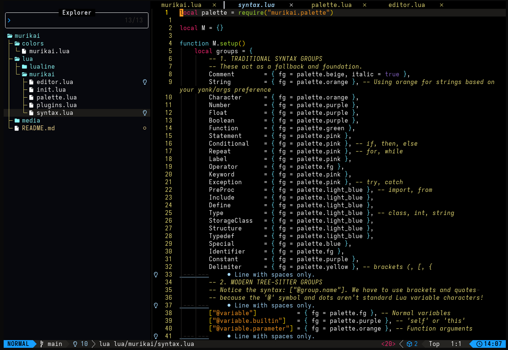

```
▗▖  ▗▖▗▖ ▗▖▗▄▄▖ ▗▄▄▄▖▗▖ ▗▖ ▗▄▖ ▗▄▄▄▖
▐▛▚▞▜▌▐▌ ▐▌▐▌ ▐▌  █  ▐▌▗▞▘▐▌ ▐▌  █  
▐▌  ▐▌▐▌ ▐▌▐▛▀▚▖  █  ▐▛▚▖ ▐▛▀▜▌  █  
▐▌  ▐▌▝▚▄▞▘▐▌ ▐▌▗▄█▄▖▐▌ ▐▌▐▌ ▐▌▗▄█▄▖
                                    
                                    
                                    
```

Um tema moderno, modular e desenvolvido inteiramente em Lua puro para o Neovim baseado no Monokai, oferecendo uma experiência visual minimalista de alto contraste com fundo puramente preto (`#000000`) e realces vibrantes.



## Características

- **100% Lua Puro:** Adeus ao Vimscript legado. Arquitetura totalmente moderna, limpa e veloz.
- **Arquitetura Modular:** Separação clara de responsabilidades (`palette`, `editor`, `syntax`, `plugins`).
- **Fundo Pure Black (`#000000`):** Excelente para telas OLED e para reduzir a fadiga ocular, mantendo excelente contraste.
- **Seleção Visual Inteligente:** Mantém o realce de sintaxe original intacto sob o bloco de seleção visual.
- **Suporte Nativo a Tree-sitter:** Destaque de código extremamente preciso e granular.

## Plugins Suportados Nativamente
O Murikai vem com ajustes visuais finos para alguns plugins LazyVim:

- Neo-tree (Aba lateral e ícones de status do Git)

- Telescope (Menus flutuantes com títulos em destaque)

- Blink.cmp (Menu de autocompletar com destaque exato de caracteres digitados)

- Gitsigns (Indicadores de adição, modificação e remoção discretos no gutter)

## Instalação e Configuração
### 1. Utilizando o Lazy.nvim
Para testar ou instalar diretamente em sua configuração do LazyVim, adicione o seguinte spec de plugin (geralmente em lua/plugins/theme.lua ou similar):


```lua
return {
  {
    "MuriloBarros304/murikai",
    lazy = false,
    priority = 1000,
    config = function()
      vim.cmd("colorscheme murikai")
    end,
  }
}
```

### 2. Ativando o Tema no Lualine
Para garantir que a barra inferior combine perfeitamente com o tema, configure o Lualine para utilizar o profile do Murikai:

```lua
return {
  "nvim-lualine/lualine.nvim",
  opts = {
    options = {
      theme = "murikai",
    },
  },
}
```
