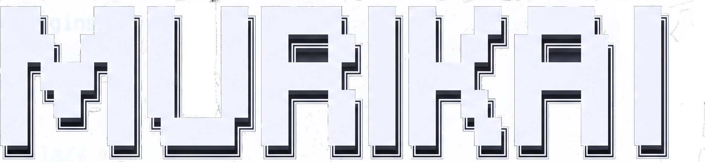

<div align="center">

</div>
<br>

Um tema moderno, modular e desenvolvido inteiramente em Lua puro para o Neovim baseado no Monokai, oferecendo uma experiência visual minimalista de alto contraste com fundo puramente preto (`#000000`) e realces vibrantes.


## Instalação e Configuração
### 1. Utilizando o Lazy.nvim
Para testar ou instalar diretamente em sua configuração do LazyVim, adicione o seguinte spec de plugin (geralmente em lua/plugins/theme.lua ou similar):


```lua
return {
  {
    "MuriloBarros304/murikai",
    lazy = false,
    priority = 1000,
    config = function()
      vim.cmd("colorscheme murikai")
    end,
  }
}
```

### 2. Ativando o Tema no Lualine
Para garantir que a barra inferior combine perfeitamente com o tema, configure o Lualine para utilizar o profile do Murikai:

```lua
return {
  "nvim-lualine/lualine.nvim",
  opts = {
    options = {
      theme = "murikai",
    },
  },
}
```
