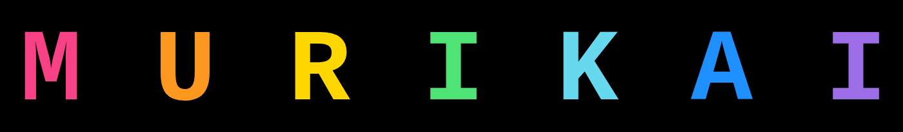
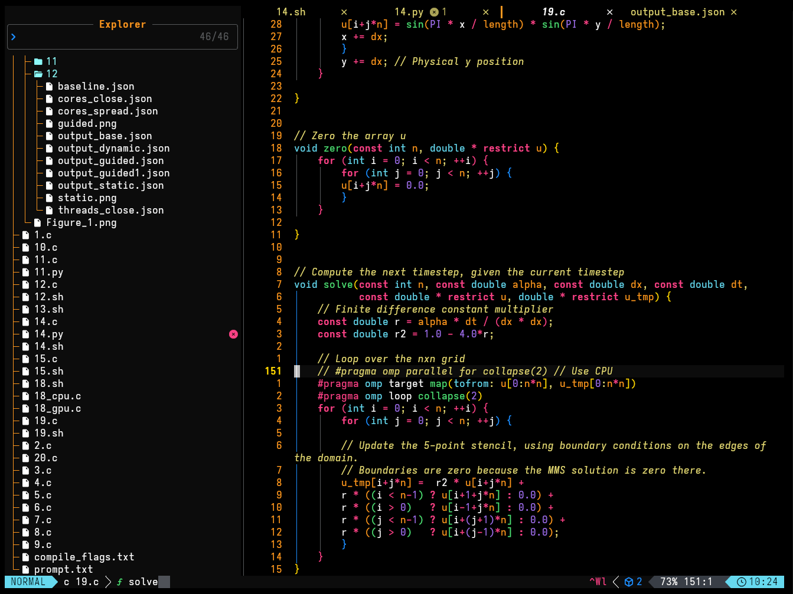

<div align="center">
    
</div>
<br>
<br>

Um tema moderno, modular e desenvolvido inteiramente em Lua puro para o Neovim baseado no Monokai, oferecendo uma experiência visual minimalista de alto contraste com fundo puramente preto (`#000000`) e realces vibrantes.



## Instalação e Configuração

### 1. Lazy.nvim

Adicione o seguinte spec em sua configuração — normalmente em `~/.config/nvim/lua/plugins/theme.lua`:

```lua
return {
    {
        "MuriloBarros304/murikai",
        lazy = false,
        priority = 1000,
        config = function()
            vim.cmd("colorscheme murikai")
        end,
    },
}
```

### 2. LazyVim

Se você usa a distribuição [LazyVim](https://www.lazyvim.org/), crie (ou edite) o arquivo `~/.config/nvim/lua/plugins/colorscheme.lua` e adicione:

```lua
return {
    {
        "MuriloBarros304/murikai",
        lazy = false,
        priority = 1000,
        config = function()
            vim.cmd("colorscheme murikai")
        end,
    },
    -- Desabilita o tema padrão do LazyVim
    { "folke/tokyonight.nvim", enabled = false },
}
```

Em seguida, abra o Neovim e execute `:Lazy sync` para instalar.

> **Dica:** O LazyVim carrega automaticamente todos os arquivos dentro de `lua/plugins/`, então nenhuma configuração extra é necessária.

### 3. Neovim

Você pode instalar manualmente clonando o repositório diretamente na pasta de pacotes nativa do Neovim:

```bash
# Linux / macOS
git clone https://github.com/MuriloBarros304/murikai \
  ~/.local/share/nvim/site/pack/themes/start/murikai
```

Depois, adicione em seu `~/.config/nvim/init.lua`:

```lua
vim.cmd("colorscheme murikai")
```

Ou, se ainda usar `init.vim`:

```vim
colorscheme murikai
```

### 4. Packer.nvim

```lua
use {
    "MuriloBarros304/murikai",
    config = function()
        vim.cmd("colorscheme murikai")
    end,
}
```

Após salvar o arquivo, execute `:PackerSync` dentro do Neovim.

### 5. vim-plug

```vim
Plug 'MuriloBarros304/murikai'
```

Após adicionar a linha acima entre `call plug#begin()` e `call plug#end()`, execute `:PlugInstall`. Em seguida, adicione ao final do seu `init.vim`:

```vim
colorscheme murikai
```

---

## Lualine

Para garantir que a barra de status combine perfeitamente com o tema, configure o [lualine.nvim](https://github.com/nvim-lualine/lualine.nvim) para utilizar o perfil do Murikai.

**Com Lazy.nvim / LazyVim** — em `lua/plugins/lualine.lua`:

```lua
return {
    "nvim-lualine/lualine.nvim",
    opts = {
        options = {
            theme = "murikai",
        },
    },
}
```

**Com Packer / configuração manual** — em `init.lua`:

```lua
require("lualine").setup({
    options = {
        theme = "murikai",
    },
})
```
